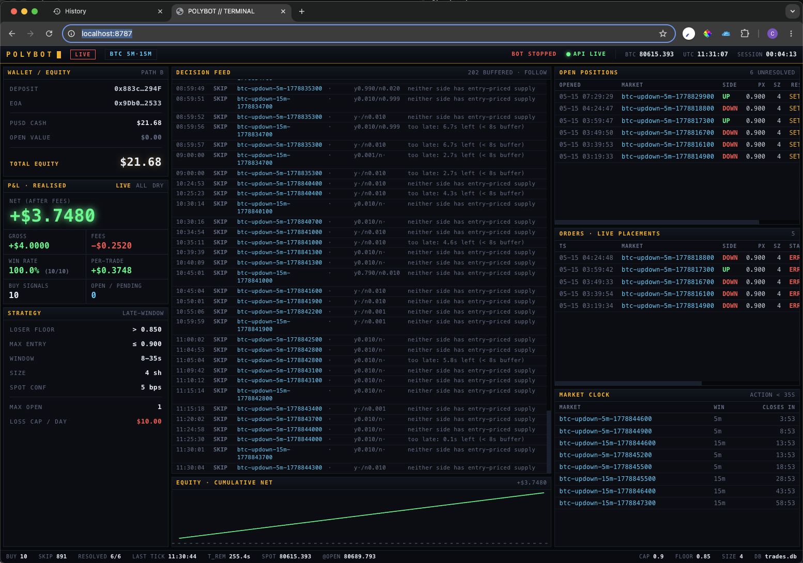

# Polybot Dashboard

Real-time, Bloomberg-terminal-style monitor for the trading bot. **Read-only and
fully decoupled** — a separate process that tails `trades.db`; it never writes to
the journal, never imports the trading loop, and never holds a write lock. The
bot can run live the entire time.



```
trades.db ──tail(0.5s)──► server.py ──WebSocket──► Vue 3 terminal UI
                              │
            gamma/CLOB API ──resolve(8s)──► realised P&L
            (P&L formula single-sourced with scripts/analyze_dry_run.py)
```

## What it shows

- **P&L** — realised net/gross/fees, win-rate, per-trade, toggle ALL / LIVE / DRY.
- **Equity curve** — cumulative net as markets settle.
- **Decision feed** — every BUY/SKIP the strategy emits, streamed live.
- **Open positions** — unresolved BUYs with a live countdown to settlement.
- **Orders** — actual live placements and their status (incl. failures).
- **Market clock** — open BTC up/down windows, highlighted inside the action band.
- **5-second amber terminal blink + beep** whenever a live trade is placed.

> P&L is *decision-level* (the strategy's edge), matching `analyze_dry_run.py`.
> The Orders panel separately shows whether placements actually filled, so a
> geo-blocked / errored order is never mistaken for a real fill.

## Run it

One-time setup:

```bash
# backend deps (kept out of the bot's requirements.txt on purpose)
.venv/bin/pip install -r dashboard/requirements.txt

# frontend deps
cd dashboard/frontend && npm install && cd -
```

### Production mode (single process — recommended for local use)

```bash
cd dashboard/frontend && npm run build && cd -
.venv/bin/python dashboard/server.py
# open http://127.0.0.1:8787
```

The server serves the built SPA directly. Rebuild the frontend and restart the
server after frontend changes.

### Dev mode (hot-reload frontend)

```bash
# terminal 1 — API + WebSocket
.venv/bin/python dashboard/server.py

# terminal 2 — Vite dev server (proxies /api and /ws to :8787)
cd dashboard/frontend && npm run dev
# open http://127.0.0.1:5173
```

## Notes

- Binds to `127.0.0.1` only. It's a local tool; do not expose it — it surfaces
  account activity and trusts any connecting client.
- The dashboard reads whatever `bot.config.load_config()` resolves (same `.env`
  / `trades.db` as the bot). Start the bot first, or the panels stay empty until
  it produces rows.
- LIVE vs DRY is a runtime flag, not in `config.py`; the header infers it from
  the most recent journal row.
